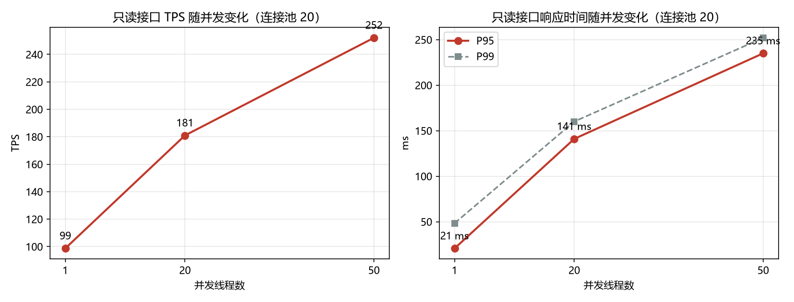
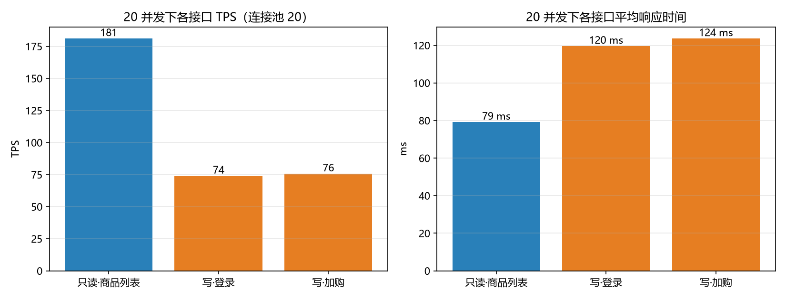
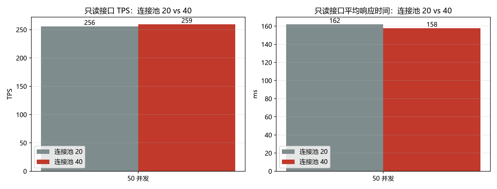

# 易淘商城 · 性能测试报告

| 项目 | 内容 |
| --- | --- |
| 项目名称 | 易淘商城（easybuy-mall）V1.0 |
| 文档类型 | 性能测试报告（Performance Test Report） |
| 被测对象 | 商品查询（只读）、登录 + 加购（读写成对）两条核心链路 |
| 压测工具 | Apache JMeter 5.6.3（JDK 11） |
| 脚本 | `perf/easybuy-perf.jmx` |
| 原始结果 | `perf/results/*.jtl`（JMeter CSV 采样明细） |
| 图表 | `perf/charts/*.png` |
| 测试人 | 曾宝仪 |
| 测试日期 | 2026-10 |

---

## 1. 测试目的

1. **量化容量**：只读与写路径在 1 / 20 / 50 并发下分别能跑到多少 TPS、响应时间怎么变；
2. **找瓶颈**：TPS 不随并发线性增长时，定位制约点到底在哪；并用「改配置再测一次」验证结论；
3. **确认不崩**：高并发下错误率是否为 0，连接是否被正确归还（有没有泄漏）。

## 2. 测试环境

| 项 | 配置 |
| --- | --- |
| 机器 | 本机（Windows），8 逻辑核 / 16 GB |
| 应用 | Python 3.13 + Flask 3.1（`app.run(threaded=True)`，开发服务器，单进程） |
| 数据库 | MariaDB 10.4.14（本机 127.0.0.1:3306），连接池 `DB_POOL_SIZE = 20` |
| 压测 | JMeter 5.6.3，与被测服务**同一台机器**，走 127.0.0.1 |
| 数据量 | `python demo_data.py` 生成：66 商品 / 33 用户 / 220 订单 / 66 张持券 |

> ⚠️ **局限**：压测进程与被测服务抢同一台机器的 CPU，所以下面所有绝对值都偏保守，
> 只能用来做**同批次横向对比**和**瓶颈定位**，不能当作生产容量指标。

## 3. 场景设计

| 序号 | 场景 | 接口 | 说明 |
| --- | --- | --- | --- |
| ① | 只读 · 商品列表 | `GET /api/products?page=1&size=10` | 典型的高频读接口，带分页查询；并发数用 `-Jthreads` 控制 |
| ② | 读写成对 · 登录 + 加购 | `POST /api/user/login` → `POST /api/cart/items` | 先登录拿到 token，再带 `Authorization: Bearer` 加购；账号按线程号取 `user_01`…，模拟 20 个不同用户的真实操作 |

**测试方法**：同一台服务进程内依次跑 1 → 20 → 50 并发，每轮前后各做一次预热与复测，避免把「机器刚启动」的冷启动误差当成并发差异。

## 4. 测试结果

### 4.1 只读接口（GET /api/products）

| 并发 | 样本数 | TPS | 平均(ms) | P95(ms) | P99(ms) | 错误率 |
| --- | --- | --- | --- | --- | --- | --- |
| 1 | 30 | **98.7** | 8.7 | 20.7 | 48.3 | 0.00% |
| 20 | 800 | **181.0** | 79.1 | 141.0 | 160.0 | 0.00% |
| 50 | 2000 | **252.0** | 169.1 | 235.0 | 252.0 | 0.00% |
| 50（复测） | 2000 | **255.6** | 161.9 | 238.0 | 254.0 | 0.00% |



### 4.2 写路径（登录 / 加购）

| 并发 | 登录 TPS | 登录平均(ms) | 加购 TPS | 加购平均(ms) | 错误率 |
| --- | --- | --- | --- | --- | --- |
| 1 | 110.7 | 60.9 | 114.2 | 69.8 | 0.00% |
| 20 | 73.9 | 119.5 | 75.6 | 123.6 | 0.00% |
| 50 | 44.6 | 205.1 | 44.4 | 209.2 | 0.00% |



### 4.3 调优验证（连接池 20 → 40）

假设「50 并发时 20 个连接的池子排队」→ 把 `DB_POOL_SIZE` 调到 40 再测同一场景：

| 场景（50 并发，只读） | TPS | 平均(ms) | P95(ms) |
| --- | --- | --- | --- |
| 连接池 20 | 255.6 | 161.9 | 238.0 |
| 连接池 40 | 259.2 | 157.6 | 221.0 |
| 差异 | +1.4% | −2.7% | −7.1% |



**结论：差异在噪声范围内 → 瓶颈不在连接池容量**，这条假设被证伪（这也是本次性能测试最有价值的一条结论：先假设、再用实验排除）。

## 5. 瓶颈分析

**① 吞吐是亚线性增长的，系统已经进入「加并发只加延迟」的阶段**

并发 1 → 20，TPS 从 98.7 涨到 181.0（×1.83，远低于理想 ×20）；20 → 50，TPS 只从 181.0 涨到 252.0（×1.39）。
与此同时平均响应时间几乎线性上升：8.7 ms → 79.1 ms → 169.1 ms（×9.1、×2.1）。这是典型的**存在串行化资源**的表现。

**② 写路径比只读更怕并发**

50 并发下，只读 252 TPS，而登录 / 加购只有 44.6 / 44.4 TPS（约为只读的 1/5.6）。
且写路径的吞吐随并发上升**不升反降**（110.7 → 73.9 → 44.6）。原因是写路径每个请求都要额外经历「取连接 → 开事务/写库 → 归还」，与只读请求争抢同一个连接池与同一个 Python 解释器。

**③ 连接池不是瓶颈（已用实验排除）**

见 4.3：池子从 20 加到 40，50 并发下 TPS 只差 1.4%。

**④ 真正的制约点：Flask 开发服务器 + GIL**

`app.py` 用的是 `app.run(threaded=True)`（Flask 自带的开发服务器，单进程），Python 侧同一时刻只能跑一个线程的字节码，本机 8 个核里有 7 个帮不上忙。
这也解释了为什么「加并发」的收益越来越小、而延迟持续上涨。

**⑤ 高并发下没有崩**

三个场景、共 5 轮、8 830 个请求，**错误率全程 0.00%**，连接池没有出现「借出未归还」的泄漏。
说明当前实现的连接获取 / 归还逻辑是可靠的 —— 系统在高并发下是**变慢**，不是**雪崩**。

**⑥ 压测必须先预热（过程发现）**

同一次测试中，未预热的轮次（20 并发）只跑到 80.7 TPS / 平均 228 ms；预热之后再测同样的场景是 181.0 TPS / 79.1 ms，**差 2.2 倍**。
冷启动（Python 模块导入、数据库缓存、连接池预热）会显著污染结果，因此所有正式数据都是在预热之后采集的。

## 6. 结论与建议

| # | 结论 / 建议 | 说明 |
| --- | --- | --- |
| 1 | 生产部署换多进程 WSGI | 用 `waitress` / `gunicorn -w 4` 替代开发服务器，把 8 个核用起来；连接池大小按 worker 数重新配置 |
| 2 | 只读热点加缓存 | 商品列表这类高频读接口加一层缓存，减少数据库往返 |
| 3 | 写路径压缩往返 | 下单 / 加购链路上的校验与写入尽量合并，减少连接借还次数 |
| 4 | 正式压测要分离压测机 | 本次压测机与被测服务同机，绝对值偏保守；生产前复测应使用独立压测机 + 生产量级数据 |
| 5 | 压测流程固化「先预热」 | 预热至少跑到稳态（本次约 500 个请求）再开始采样 |

## 7. 怎么复现

```bat
rem 1) 准备被测服务与演示账号
python init_db.py
python demo_data.py
python app.py

rem 2) 另开一个窗口跑压测（JMeter 5.6.x，bin 目录需在 PATH 或设置 JMETER_HOME）
perf\run_perf.bat

rem 3) 单场景手动跑：-Jthreads 并发线程数，-Jloops 每线程循环次数
jmeter -n -t perf\easybuy-perf.jmx -l perf\results\my.jtl -Jthreads=50 -Jloops=40
```

详细参数见 [`../perf/README.md`](../perf/README.md)。
